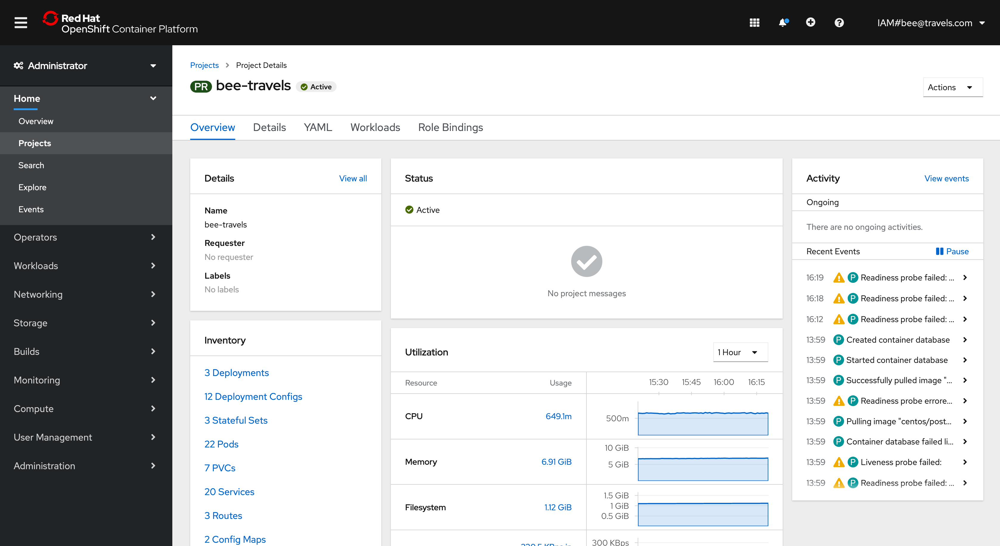
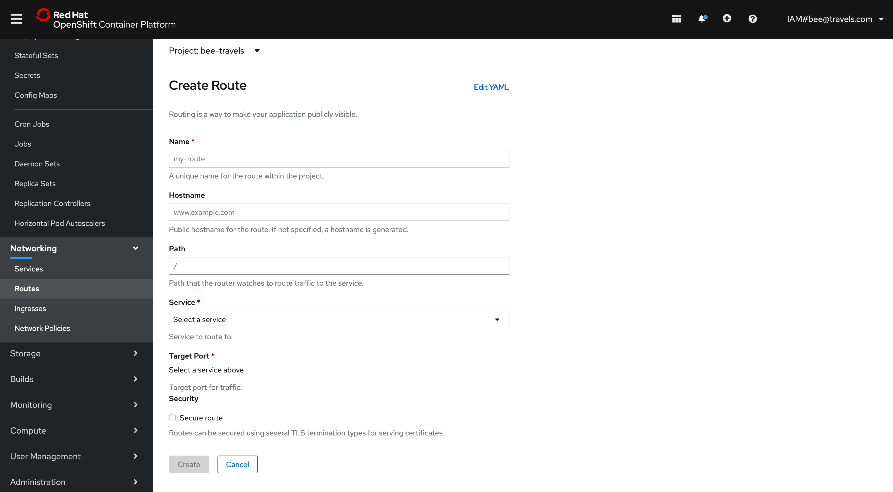
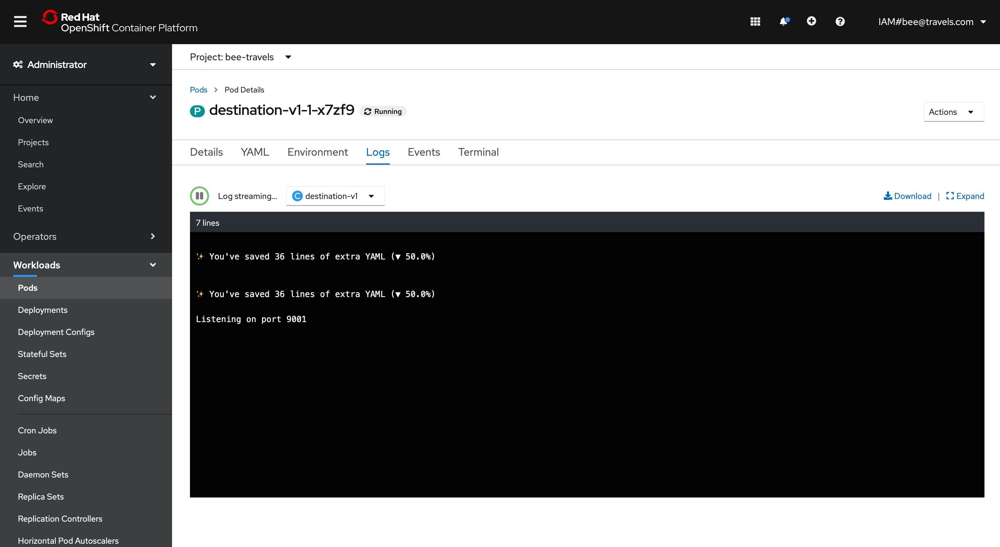

Bee Travels is able to be deployed to RedHat's OpenShift container platform. Learn more about OpenShift and how Bee Travels interacts with it below:

## IBM Cloud

IBM Cloud allows users to provision an OpenShift cluster [here](https://cloud.ibm.com/kubernetes/catalog/create?platformType=openshift). The provisioning process takes about 20-30 minutes.

Deploying Bee Travels to OpenShift on IBM Cloud can be done by using the Bee Travels Wizard or cloning the [config](https://github.com/bee-travels/config) repo.

To deploy v1, run this:
```
./deploy-openshift-v1.sh
```

To deploy v2, run this:
```
./deploy-openshift-v2.sh
```

## LinuxONE Community Cloud

The OpenShift Container Platform is available on the LinuxONE Community Cloud built on IBM's Z Mainframe. Currently, [creating a cluster](https://linuxone.cloud.marist.edu/#/register?flag=OCP) is only available as a trial.

Because this is built on a Z Mainframe, the Docker images used for containers have to be built using `s390x` architecture and not `x86`. Let's take a look at how we modify this in Bee Travels for the Node.js version. Bee Travels Node.js service Docker images are built using the `node:12.11.0-alpine` base image. Below is the first line of the Dockerfile:

```
FROM node:12.11.0-alpine
```

By default, this pulls the `x86` version of the base image. To modify this to be built with the `s390x` architecture for the base image, the specifc `sha256` must be specified. For thie specific base image, this can be found [here](https://hub.docker.com/layers/node/library/node/12.11.0-alpine/images/sha256-89012ced616beb0b677659c62bd9e9ffc979a6372ff0f9cb562b23d785fbac82?context=explore). Below is what that same line in the Dockerfile looks like to work with the new architecture:

```
FROM node:12.11.0-alpine@sha256:89012ced616beb0b677659c62bd9e9ffc979a6372ff0f9cb562b23d785fbac82
```

Deploying Bee Travels to OpenShift on the LinuxONE Community Cloud can be done by using the Bee Travels Wizard or cloning the [config](https://github.com/bee-travels/config) repo.

To deploy v1, run this:
```
./deploy-openshift-v1-z.sh
```

## Dashboard



The OpenShift dashboard provides a nice alternative to the [oc cli](https://docs.openshift.com/container-platform/4.3/cli_reference/openshift_cli/getting-started-cli.html) with a GUI to view and manage your cluster.

## Operators

Depending on where your OpenShift cluster is provisioned, your cluster may come with operators that you can install into your cluster. Operators can be installed from [OperatorHub](https://operatorhub.io/) and the [Red Hat Marketplace](https://marketplace.redhat.com/en-us). 

Bee Travels takes advantage of operators in OpenShift. One operator that Bee Travels works with is the [PostgreSQL database operator](https://operatorhub.io/operator/postgresql-operator-dev4devs-com). This operator can be installed either manually through the UI by following [these](https://developer.ibm.com/tutorials/operator-hub-openshift-4-operators-ibm-cloud/) steps or automatically in the `deploy-openshift-v2.sh` script by specifying the database type as seen below:

```
./deploy-openshift-v2.sh -d postgres
```

## Accessing Services Externally

When deploying an application to an OpenShift cluster, there is no way to access any of the services from outside the cluster without exposing a service. In the case of Bee Travels, we are concerned with accessing the UI service this is the only service a user would interact with. In order to expose the UI, a Route needs to be defined. 

A Route can be created via the OpenShift dashboard as seen below:



Or a Route can be created by defining an OpenShift Route [yaml file](https://github.com/bee-travels/config/blob/master/openshift/ui-route.yaml) to your cluster via the cli and running the following command:

```
oc apply -f openshift/ui-route.yaml
```

This Route file can also be deployed using the `deploy-openshift.sh` scripts if the OpenShift Cluster is on IBM Cloud. To do this, the cluster name must be specified as seen below:

```
./deploy-openshift-v1.sh -c <CLUSTER_NAME>
```

## Debugging

As part of the application development life cycle, there will come a time when debugging will be needed to figure out why something is not working as intended in your cluster. Through the OpenShift dashboard, you can view activity of running services in your Project details. If you know which service is not functioning properly, you can view the logs and events for that specific service's pod as seen below:



## External Content

* [Using Openshift on Different Clouds](https://video.ibm.com/recorded/127936835)
* [Deploy Red Hat UBI to OpenShift](https://developer.ibm.com/patterns/deploy-to-openshift-4-redhat-universal-base-image)