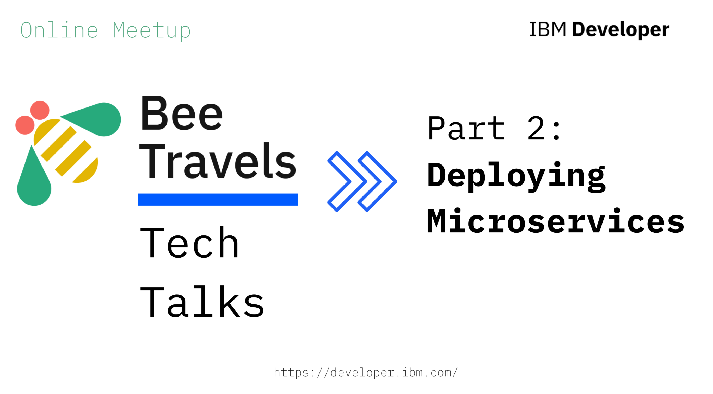
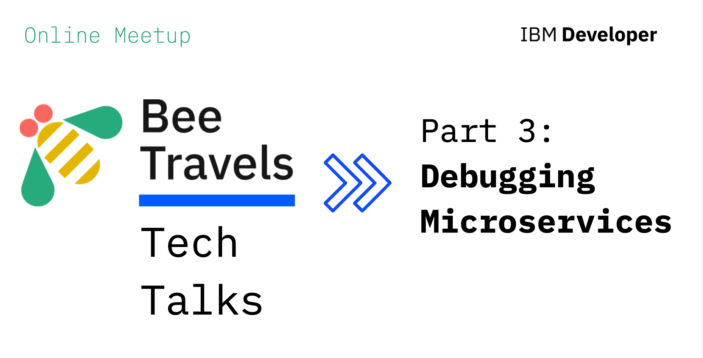
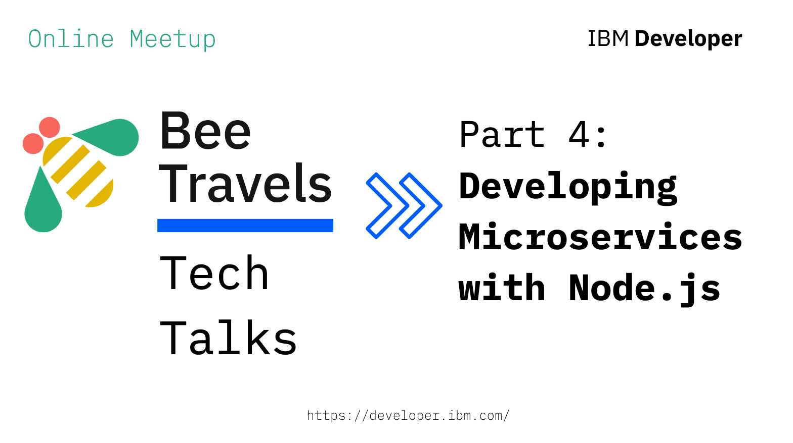
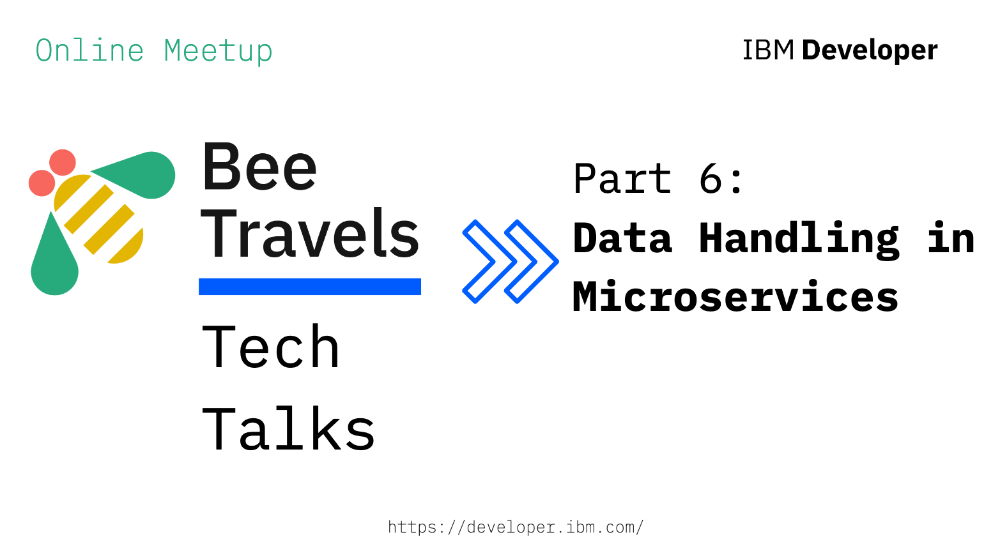

Come join us each week to hear what the buzz is about Bee Travels and to learn more about the ins and outs of building cloud-native microservices!

### [Part 1: Designing Microservices](https://www.crowdcast.io/e/beetravels_part1) 

 - Register or watch replay [here](https://www.crowdcast.io/e/beetravels_part1)

### [Part 2: Deploying Microservices](https://www.crowdcast.io/e/beetravels_part2) 

 - Register or watch replay [here](https://www.crowdcast.io/e/beetravels_part2)

### [Part 3: Debugging Microservices](https://www.crowdcast.io/e/beetravels_part3) 

 - Register or watch replay [here](https://www.crowdcast.io/e/beetravels_part3)

### [Part 4: Developing Microservices in Node.js](https://www.crowdcast.io/e/beetravels_part4) 

 - Register or watch replay [here](https://www.crowdcast.io/e/beetravels_part4)

### [Part 5: Virtual Hands On Lab](https://www.crowdcast.io/e/beetravels_part5) 

 - Register or watch replay [here](https://www.crowdcast.io/e/beetravels_part5)

### [Part 6: Data Handling in Microservices](https://www.crowdcast.io/e/beetravels_part6) 

 - Register or watch replay [here](https://www.crowdcast.io/e/beetravels_part6)

 