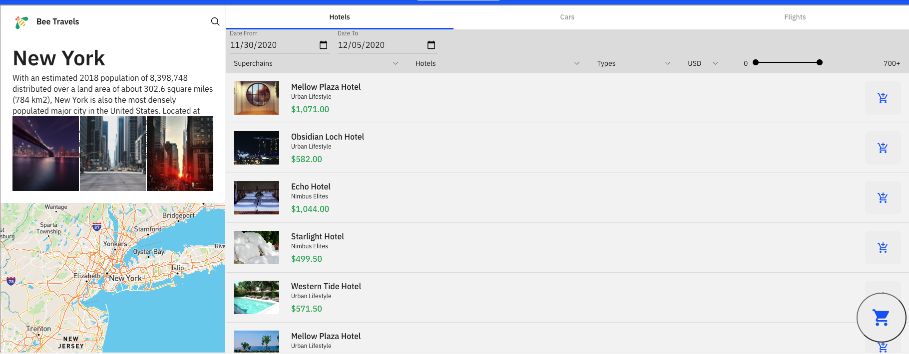
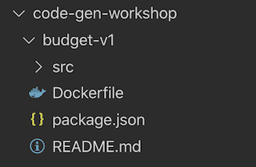
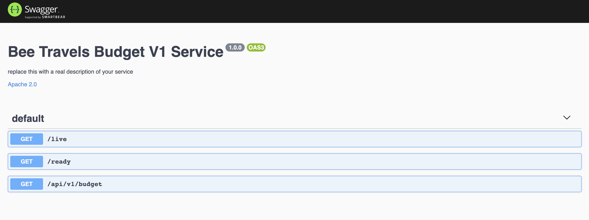
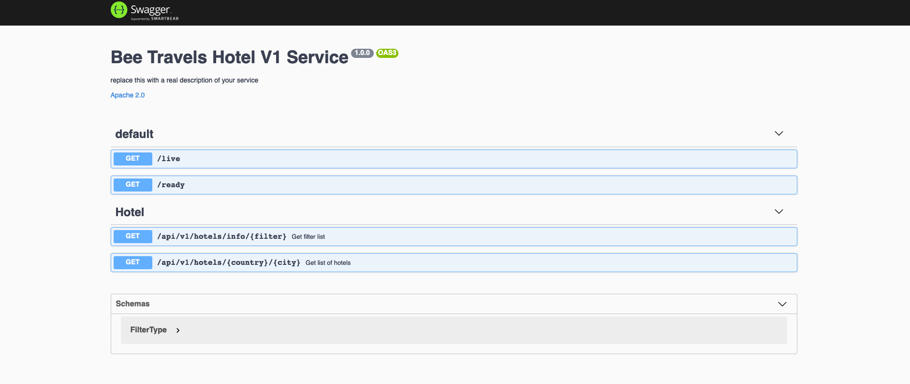
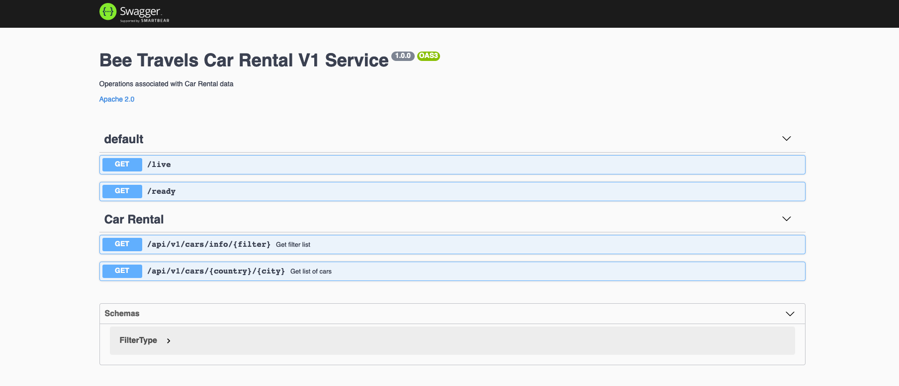
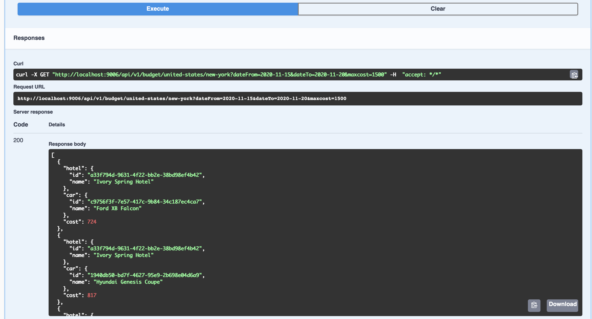

## About 
Bee Travels is a travel booking application that is composed of several mircoservices. 
These microservices include: 
- Hotel Microservice
- Car Rental Microservice 
- Flight Microservice 
- Currency Exchange Microservice 
- UI Front End 
- UI Back End 

Each mircoservice can be run independently, or together to form the full service. Bee Travels can be used to search and book hotels, flights and car rentals for various destinations across the world.



## Objective
In this workshop we will be using the Node.js code generation service template to seemlesly create microservices in Node.js. We will be creating our own bugeting microservice using the Bee Travels Node hotel and car rental microservice to build a service that gives us both hotel and car rental data based on our maximum budget. 

Let's get started! 

## Prerequisites
 - [Install Docker](https://docs.docker.com/get-docker/)
 - [Install Yarn](https://classic.yarnpkg.com/en/docs/install/#mac-stable)
 - Install Node Version 12.0.0 : ```nvm install v12.0.0```

## Getting Started with Code Generation Node Template  
### Step 1
 Make a directory with any name and cd into it. Once you are in the directory run : 
`npx bee-bootstrap node` 

Name the following : 
```
Service name (destination-basic): budget-v1
Service route (destinations): budget
Service port (9000):9000 
```

### Step 2
At this point you should see a folder in your directory with the service name you just created. In our case this folder is called `budget-v1`. If you cd into that folder you will see a `src` folder, a dockerfile , a package.json, and a README.md file :  



Cd into `budget-v1` and run `yarn` 
>  Make sure you are using Node version 12.0.0 if not you can install with `nvm install v12.0.0`

You should see : 
```
yarn install v1.22.5
info No lockfile found.
[1/4] 🔍  Resolving packages...
[2/4] 🚚  Fetching packages...
[3/4] 🔗  Linking dependencies...
[4/4] 🔨  Building fresh packages...
success Saved lockfile.
✨  Done in 9.64s.
```

### Step 3 
Run `yarn start` and you should see : 
```
yarn run v1.22.5
$ nodemon -r esm ./src/bin/www.js
[nodemon] 2.0.6
[nodemon] to restart at any time, enter `rs`
[nodemon] watching path(s): *.*
[nodemon] watching extensions: js,mjs,json
[nodemon] starting `node -r esm ./src/bin/www.js`

✨ You've saved 6 lines of extra YAML (▼ 24.0%)

Listening on port 9000
``` 
Now go to ```http://localhost:9000/api-docs/```

You should see the service up and running



Congrats you have the Node Service template up and running! Lets get started with building the hotel and car microservice. 
## Building a Buget Microservice

### Step 1 
Our budget service api will be taking in data such as : 
- city
- country
- date to (departing date)
- date from (drriving date)
- max cost 

We need to create a GET request api endpoint that requires this information 

In `budget-v1 > src > routes` you will see a file called `budget.js` This is the file where we will be creating our GET request api. 

The api endpoint of this file will be `/api/v1/budget/{country}/{city}` 

You can replace all the code in this file with this [budget.js code](https://github.com/pmmistry/bee-travels-workshop/blob/main/budget-v1/src/routes/budget.js) 

The GET Request is the main aspect of this code that is created to set up the data that will be required by this API
``` 
/**
 * GET /api/v1/budget/{country}/{city}
 * @tag Budget
 * @summary Get list of hotels and car rentals that fit a budget
 * @description Gets data for hotel and cars associated with a specific city and budget.
 * @pathParam {string} country - Country of the hotel using slug casing.
 * @pathParam {string} city - City of the hotel using slug casing.
 * @queryParam {string} dateFrom - Date From
 * @queryParam {string} dateTo - Date To
 * @queryParam {number} maxcost - Max Cost.
 * @response 200 - OK
 * @response 500 - Internal Server Error
 */
router.get("/:country/:city", async (req, res, next) => {
  // const context = new Jaeger("city", req, res);
  const { country, city } = req.params;
  
  const {
    maxcost,
    dateFrom,
    dateTo,
  } = req.query;
  req.log.info(`getting budget data for -> /${country}/${city}`);
 
  try {
    const data = await breaker.fire(
      country,
      city,
      {
        maxCost: parseInt(maxcost, 10) || undefined,
        dateFrom: dateFrom || undefined,
        dateTo: dateTo|| undefined,
      },
      context
    );
    res.json(data);
  } catch (e) {
    console.log(e)
    next(e);
  }
});

```
### Step 2 
The budget service is dependent on the hotel microservice 
and the car rental microservice. We will be creating a budget service that gives us both hotel and car data based on our max budget. 

The first thing we need to do before we build our microservice is get both the hotel microservice and car microservice up and running 

**Run Hotel Service** 

Make sure you have docker installed and run the following commands : 

```
docker pull beetravels/hotel-v1:node-540d5182fe943a3ad87c559dd7fcce025cec9833
docker run -p 9101:9101 beetravels/hotel-v1:node-540d5182fe943a3ad87c559dd7fcce025cec9833
```
You should see : 
```
✨ You've saved 53 lines of extra YAML (▼ 54.6%)
Listening on port 9101
```
If you go to `localhost:9101/api-docs/` in your browser you should see your hotel service up and running. 



**Run Car Service** 

Run the following commands to run the car service : 
```
docker pull beetravels/carrental-v1:node-540d5182fe943a3ad87c559dd7fcce025cec9833
docker run -p 9102:9102 beetravels/carrental-v1:node-540d5182fe943a3ad87c559dd7fcce025cec9833
```
You should see : 
```
✨ You've saved 57 lines of extra YAML (▼ 54.8%)

Listening on port 9102
```
If you go to `localhost:9102/api-docs/` in your browser you should see your car service up and running.



Now that you have both these services up and running you can call both hotel and car apis in your buget microservice 

### Step 3 
With both Hotel and Car microservices up and running we can create a service js file that calls on these apis to get both hotel and car data 

In `budget-v1 > src > services` create a `hotel.js` file and then create a `car.js` file 

**hotel.js file :**  

Add this code to the `hotel.js` file to call the hotel microservice 
```
import axios from "axios";

const HOTEL_URL = process.env.HOTEL_URL || "http://localhost:9101";

export async function getHotelData(country,city,dateFrom,dateTo) {
  const data = {
    dateFrom: dateFrom,
    dateTo: dateTo
  };
  const res = await axios.get(HOTEL_URL + `/api/v1/hotels/${country}/${city}`, {params:data});
  return res.data;
}

export async function hotelReadinessCheck() {
  const isReady = await axios.get(HOTEL_URL + "/ready");
  return isReady;
}

```

Notice that you are calling the hotel api with the country and city end point. You can use the [hotel.js code](https://github.com/pmmistry/bee-travels-workshop/blob/main/budget-v1/src/services/hotel.js) as a reference

**car.js file :** 

Add this code to the `car.js` file to call the car microservice : 

```
import axios from "axios";

const CAR_URL = process.env.CAR_URL || "http://localhost:9102";

export async function getCarData(country,city,dateFrom,dateTo) {
  const data = {
    dateFrom: dateFrom,
    dateTo: dateTo
  };
  const res = await axios.get(CAR_URL + `/api/v1/cars/${country}/${city}`, {params:data});
  return res.data;
}

export async function carReadinessCheck() {
  const isReady = await axios.get(CAR_URL + "/ready");
  return isReady;
}
```
You can use the [car.js code](https://github.com/pmmistry/bee-travels-workshop/blob/main/budget-v1/src/services/car.js) as a reference

### Step 4 
Now that we have created both hotel.js and car.js files we are going to be adding some code to the `budget-v1 > src > services` `dataHandler.js` file 

In this file we will be creating a function that does 5 steps
1. Makes sure date range is valid 
2. Calls the hotel service api end point
3. Calls the car service api end point
4. Finds car and hotel based on max price , date range and location
5. Return a list of hotel and car data based on max price, date range and location

You can replace all the code in the dataHandler.js file with this [dataHandler.js code](https://github.com/pmmistry/bee-travels-workshop/blob/main/budget-v1/src/services/dataHandler.js)

### Step 5 
In the `budget-v1 > src > errors` folder create a file called `IllegalDateError.js` to flag any errors with incorrect date format. 

Add the following code or refer to [IllegalDateError.js](https://github.com/pmmistry/bee-travels-workshop/blob/main/budget-v1/src/errors/IllegalDateError.js)

```
class IllegalDateError extends Error {
  constructor(date) {
    super(`Date not legal ${date}`);
    // Ensure the name of this error is the same as the class name
    this.name = this.constructor.name;
    // This clips the constructor invocation from the stack trace.
    // It's not absolutely essential, but it does make the stack trace a little nicer.
    Error.captureStackTrace(this, this.constructor);
  }
}

export default IllegalDateError;
```

Once you have these files set up you are ready to run the application 

Run `yarn start` 

You should see : 
```
yarn run v1.22.5
$ nodemon -r esm ./src/bin/www.js
[nodemon] 2.0.6
[nodemon] to restart at any time, enter `rs`
[nodemon] watching path(s): *.*
[nodemon] watching extensions: js,mjs,json
[nodemon] starting `node -r esm ./src/bin/www.js`

✨ You've saved 33 lines of extra YAML (▼ 55.9%)

Listening on port 9000
```

If you go to `http://localhost:9000/api-docs/` you should see the api end point.If you try it out with the required parameters you should see the following output : 



### Congratulations
Congrats on creating the budget microservice! You can now consider deploying this application. 